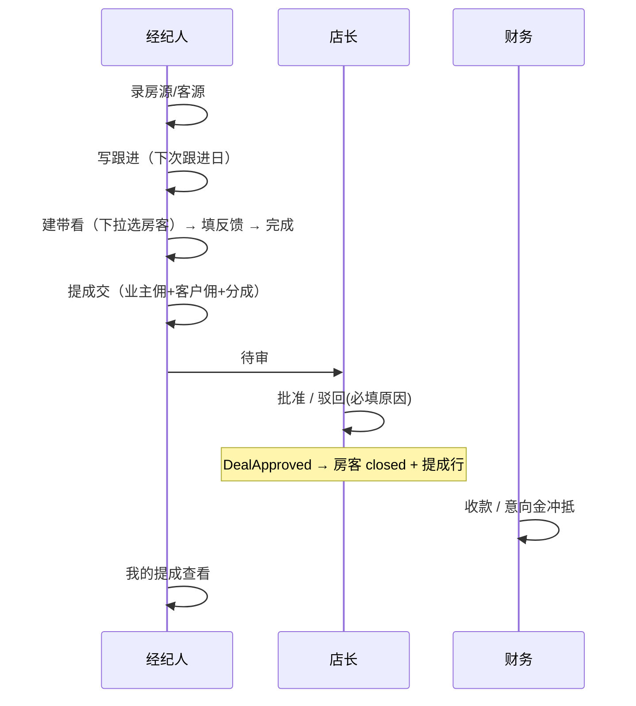

# 软件设计方案：架构 · UI · 交互 · 功能

| 项 | 内容 |
|----|------|
| 产品 | **未来家本地**（自研房产中介工作台，离线优先） |
| 文档版本 | **DES-1.0** · 2026-08-07 |
| 状态 | 与代码现状对齐（W0～W7 / OUT-01～06 本地能力已落地） |
| 代码根 | `E:\未来家本地` |
| 配套 | [`README.md`](../README.md) · [`AI全功能开发任务板.md`](./AI全功能开发任务板.md) · [`MVP需求规格.md`](./MVP需求规格.md) · [`整系统开发方案.md`](./整系统开发方案.md) · [`主路径人工验收清单.md`](./主路径人工验收清单.md) |
| 红线 | **不做**厂商许可/指纹（AI-OUT-07）；第三方 CA 电子签 / 真隐号拨打 / 外网群发仅作远期接口预留 |

> 本文是**当前可落地的设计真源**：描述「已经怎么做」与「按此规则继续做」。厂商对照见功能说明书；波次排期见任务板。

---

## 0. 设计目标与原则

### 0.1 产品目标

支撑单店/少量门店中介的日常闭环：

**录盘 → 录客 → 跟进 → 带看 → 成交审批 → 收款 → 提成**，辅以组织权限、办公轻量、报表与本地增值（楼盘字典、钥匙、新房报备、简易收支等）。

### 0.2 设计原则（写死）

| # | 原则 | 落地含义 |
|---|------|----------|
| 1 | **业务进内核** | 规则只在 `server/domain/*`；`main.js` 只做壳；页面不做权限真相 |
| 2 | **传输可换** | 今天 IPC，明天 HTTP，同一套 `dispatch` |
| 3 | **服务端强制** | UI 隐藏按钮是礼貌；`auth/policy.js` 拒绝才是安全 |
| 4 | **事件解耦** | 跨域状态用领域事件（如 `DealApproved`），禁止交易域直接改房/客表 |
| 5 | **枚举英文、界面中文** | 库内 `available/closed/...`；UI 行话「在售/已成交」 |
| 6 | **离线优先** | SQLite 本地库；不依赖厂商云 |
| 7 | **门禁可证伪** | 改功能必须 `npm run smoke` / `accept` / 日常 `health` 绿 |

---

## 1. 软件架构设计

### 1.1 逻辑分层

```
┌─────────────────────────────────────────────────────────┐
│  Electron 壳  main.js / shell.*                         │
│  窗口 · 多标签 BrowserView · 下载 · 更新 UI · 配置        │
└───────────────────────────┬─────────────────────────────┘
                            │ preload 白名单
┌───────────────────────────▼─────────────────────────────┐
│  渲染层  renderer/                                       │
│  login → biz（侧栏工作台）· api.js · ui.js               │
│  禁止页面直连 ipcRenderer / 直读 SQLite                   │
└───────────────────────────┬─────────────────────────────┘
                            │ api:call(action, payload)
┌───────────────────────────▼─────────────────────────────┐
│  业务内核  server/（纯 Node，可脱离 Electron）            │
│  route/dispatch → auth → domain → repo → db             │
│  events/bus · audit/log                                 │
└───────────────────────────┬─────────────────────────────┘
                            │
                    SQLite data/app.db
                    migrations/001～007
```

### 1.2 关键目录职责

| 路径 | 职责 | 禁止 |
|------|------|------|
| `main.js` | 窗口、BrowserView 标签、下载、配置窗 | 业务规则、算提成、改成交状态 |
| `preload.js` | 暴露白名单 API | 透传任意 Node / 任意 channel |
| `renderer/api.js` | 前端唯一数据出口 | 业务页面绕过它调 IPC |
| `renderer/ui.js` | 空态、toast、中文时间 | 权限判定 |
| `renderer/biz.js` | 列表/表单/导航编排 | 自写一套 RBAC |
| `server/route/dispatch.js` | action → domain 方法 | 堆业务细节 |
| `server/auth/policy.js` | **权限单点** | 在各 domain 复制一套可见性 |
| `server/domain/*` | 用例与状态机 | 依赖 Electron API |
| `server/db/repo` | 持久化 | 领域层裸 SQL 蔓延（新代码优先走 repo） |
| `scripts/*` | smoke / accept / health / backup | 影子实现权限「假绿」 |

### 1.3 请求链路（同步心智模型）

```
用户点击
  → biz.js 组装 payload
  → api.js → preload.apiCall
  → ipc-adapter → dispatch(action, payload, session)
  → policy 预检 / domain 内再检
  → repo 读写 SQLite
  → 可选 emit 事件 → 他域订阅
  → audit 写日志
  → 返回 { ok, data|message }
  → ui toast / 刷新列表
```

### 1.4 限界上下文（领域切分）

| 上下文 | 目录 | 核心对象 | 对外事件（示例） |
|--------|------|----------|------------------|
| 组织 | `org/` | store, user, settings | 会话相关 |
| 盘源 | `house/` `property/` | house, community, key, survey, verify | 状态变更审计 |
| 客源 | `customer/` | customer, visibility | — |
| 活动 | `activity/` | follow, view | `FollowCreated` `ViewCreated` |
| 交易 | `deal/` | deal, splits | `DealSubmitted` `DealApproved` |
| 结算 | `settlement/` | payment, commission, earnest | — |
| 办公 | `office/` | announcement, leave, message, attendance, knowledge | — |
| 新房 | `newhome/` | project, report | — |
| 财务轻量 | `finance/` | voucher | — |
| 合规本地 | `esign/` | sign ack | — |
| 人事轻量 | `hr/` | job, applicant, salary | — |
| 报表 | `report/` | 只读聚合 | — |

### 1.5 角色与数据范围

| 角色 | 代码枚举 | 数据范围 | 典型写权限 |
|------|----------|----------|------------|
| 管理员 | `admin` | 全公司 | 组织、参数、作废成交、全量审批 |
| 店长 | `store_manager` | 本店 | 审批本店成交、验真、请假批、群发本店 |
| 经纪人 | `agent`（兼容 `staff`） | 本店可见盘客 + 本人私客 | 录盘客、跟进、带看、提成交、报备 |
| 财务 | `finance` | 成交/收款/提成/收支为主 | 收款、流水作废、凭证；无盘客录入 |

**隔离硬规则（摘要）**

- 跨店：店长/经纪人默认不可见他店私客与他店报备。
- 保密盘 / 私客：非维护人经纪人不可见或电话脱敏。
- 隐号模式：展示层强制脱敏；**不是**运营商隐号。
- 成交：经纪人提交；店长/管理员审批（驳回原因必填）；财务/管理员收款。

### 1.6 状态机（功能正确性核心）

| 对象 | 状态（库） | UI 行话要点 |
|------|------------|-------------|
| 房源 | `draft → available ↔ suspended → deal_pending → closed`；可 `withdrawn` | 非法跳转服务端拒绝；终态无乱改 |
| 客源 | `new → following → viewing → deal_pending → closed`；`invalid` / `public_pool` 冻结 | 跟进/带看/成交事件只前进 |
| 成交 | draft/pending/approved/rejected/void…（以 domain 为准） | 有确认收款不可随意作废 |
| 带看 | 进行中/完成；`feedback≠pending` 才能完成 | 前后端双校验 |
| 请假 | draft→pending→approved/rejected（可 cancel） | 不可自批、不可跨店批 |
| 新房报备 | protected / expired / invalid / arrived | 保护期内同项目同号拒重 |
| 签署确认 | draft→pending→signed/rejected | 本地确认，非 CA |

### 1.7 数据与演进

- **库**：SQLite WAL，`data/app.db`；结构 `migrations/*.sql`。
- **双绑定**：Electron 用 `better-sqlite3`；Node smoke 可用 `node:sqlite`。
- **P2 预留**：`company_id` 已存在；HTTP adapter / PostgreSQL 见整系统方案，**未触发不做**。
- **实体 ID（已加固）**：`nextId` = `{prefix}{time36}-{seq36}-{rand}`（完整时间 base36 + 进程内序号 + 随机）；旧行 ID 不变。审计 ID 共用同一生成器。

### 1.8 质量架构

```
开发改动
  → npm run smoke（≥574）
  → npm run accept（真实 createServer+dispatch，≥277）
  → npm run health（smoke→accept→launch-check→backup）
  → 人工清单（四角色 UI）
```

断言只增不减（accept-docs）；红灯用 `red-light` / 回滚纪律，不删断言凑绿。

---

## 2. UI 设计

### 2.1 信息架构（IA）

```
登录页
  └─ 业务台（侧栏 + 主区）
       ├─ 工作台（统计 / 今日待办 / 盘客存量）
       ├─ 盘客：房源 · 楼盘字典 · 钥匙 · 实勘 · 客源 · 跟进 · 带看
       ├─ 新房：项目 · 报备
       ├─ 交易：成交收款 · 简易收支 · 我的提成 · 业绩报表
       ├─ 办公：公告 · 消息 · 请假 · 考勤 · 签署 · 招聘 · 薪酬 · 知识库
       └─ 管理：组织 · 审计（店长/管理员）
壳层（shell）
  └─ 多标签 · 地址/导航工具 · 下载 · 配置入口
```

侧栏项按 `data-roles` **显隐**；隐藏 ≠ 安全（接口仍校验）。

### 2.2 布局结构

| 区域 | 规格 | 说明 |
|------|------|------|
| 侧栏 | 固定约 220px，深色渐变 | Logo「未」+ 产品名、用户盒、消息铃铛、导航、底部路径提示 |
| 主区 | 浅底 `#f3f6fb`，内边距 ~22px | 单 tab 显示；标题 + 操作头 + 筛选条 + 列表行 |
| 弹层 | `<dialog>` 圆角卡片 | 新建/编辑表单；详情时间线加宽 |
| 反馈 | 右下 toast | success / warn / error；列表空态 / 错误行统一组件 |

### 2.3 视觉语言（现状 Token）

来自 `renderer/biz.css`，后续改版应保留语义而非另起一套：

| Token | 值 | 用途 |
|-------|-----|------|
| `--ink` | `#172033` | 主文字 |
| `--muted` | `#617084` | 次要说明 |
| `--line` | `#e3e8ef` | 边框 |
| `--bg` | `#f3f6fb` | 主区底 |
| `--side` | `#101826` 系渐变 | 侧栏 |
| `--accent` | `#1f6feb` | 主按钮 |
| `--card` | `#fff` | 卡片/行 |

- 圆角：按钮/输入约 10px，卡片/行约 14px。
- 字体：微软雅黑 / Segoe UI（桌面中介场景可读优先）。
- 状态色：逾期红 `#c62828`；今日跟进蓝底；作废行降透明度；警告条暖橙底。

### 2.4 组件模式（统一，忌各页发明）

| 模式 | 用法 |
|------|------|
| **Nav button** | `data-tab` 切换 section；`.on` 高亮 |
| **Filters 条** | 同一行 input/select；复杂筛两行 |
| **Row 列表** | 左标题+元信息，右 ops 按钮组 |
| **Stat 卡片** | 工作台数字；可点击带筛选跳转 |
| **Dialog 表单** | label 栅格；只读灰底；多选 select |
| **Empty / Error** | `ui.listEmpty` / `listError`，禁止空白主区无说明 |
| **Toast** | API `ok:false` → error toast，少用 `alert` |
| **时间** | `YYYY-MM-DD HH:mm`，近时「今天/昨天」 |

### 2.5 角色差异化 UI

| 角色 | 侧栏差异 | 工作台 |
|------|----------|--------|
| admin | 全模块 | 全公司待办 + 存量 |
| 店长 | 无跨店管理外的限制项按权 | 本店待办 + 存量 |
| 经纪人 | 无审计等管理项 | 本人相关待办 + 存量 |
| 财务 | 突出成交/收支/提成/报表；弱化或隐藏盘客录入 | 收款向待办；可无存量写区 |

### 2.6 壳层 UI

- **多标签**：至少保留 1 个业务标签；`+` 新建、点击切换、`×` 关闭。
- **登录**：角色说明 + 默认账号提示；失败明确文案。
- **配置/下载/更新**：独立小页，不塞进业务侧栏。

### 2.7 UI 演进建议（非阻塞）

1. 侧栏过长 → 分组折叠（盘客 / 交易 / 办公 / 管理）。
2. 列表虚拟滚动（万级房客时）。
3. 设计 token 抽到单一 `tokens.css`，业务页只引语义类名。
4. 避免再堆「说明卡片」进首屏；验收说明进文档即可。

---

## 3. 交互设计

### 3.1 主导航交互

| 行为 | 反馈 |
|------|------|
| 点侧栏 | 立即切 tab，保留该页筛选状态（同会话） |
| 点铃铛 / 消息 | 进消息中心；未读角标更新 |
| 点工作台待办数字 | 跳转对应列表并**预置筛选**（今日/逾期/待审等） |
| 点盘客存量卡片 | 跳房源「在售」或客源公私筛选 |
| 空闲 8h | 自动登出 → 登录页 |

### 3.2 主路径交互故事（Happy Path）



### 3.3 列表与表单交互规范

| 场景 | 规范 |
|------|------|
| 新建/编辑 | Dialog；必填前后端双检；成功 toast + 关窗刷新 |
| 下拉关联 | 带看/成交**必须**选房客，禁止只靠手输 ID |
| 危险操作 | 作废/驳回：原因必填；不可静默成功 |
| 非法状态 | 服务端 message 原文 toast；不假装成功 |
| 查重 | 客源手机：软提示可继续；无权限不泄露明文 |
| 筛选 | 输入即滤或点选即滤；提供「清空筛选」 |
| 导出 | CSV UTF-8 BOM；按钮随角色显隐，接口再鉴权 |
| 隐号 | 开关打开后列表/复制均为脱敏 |

### 3.4 反馈层级

1. **行内**：逾期高亮、作废灰显、验真标签。  
2. **Toast**：操作结果、权限拒绝。  
3. **空态**：无数据引导「去新建」而非空白。  
4. **错误态**：列表加载失败用 list-error，可重试（刷新）。  

### 3.5 权限交互（防尴尬）

- 无权限按钮：**优先不渲染**；若残留点击 → toast「无权限」类文案。  
- 跨店操作：明确「只能操作本店」。  
- 财务进盘客相关：侧栏隐藏 + 接口拒绝，双保险。  

### 3.6 消息与协同

| 触发 | 通知谁 |
|------|--------|
| 成交提交/审批/驳回 | 相关经纪人/店长 |
| 今日带看、收款、请假、公告 | 订阅角色 |
| 钥匙变动、迟到打卡、新房报备 | 相关人/店长 |
| 站内群发 | 本店或全公司（按发件人权限） |

交互：未读数 → 进入标已读 / 全部已读。

### 3.7 错误与边界体验

| 边界 | 体验 |
|------|------|
| 带看 feedback=pending 点完成 | 拦截说明须先选反馈 |
| 保护期内重复报备 | 拒绝并提示保护中 |
| 超收 | 允许记一笔但预警 |
| 空月报表 | 友好空态 + 仍可导出空表提示 |
| 重复打卡 | 拒绝「今日已上班」类 |

---

## 4. 功能设计方案

### 4.1 功能地图（模块 → 能力）

```
壳：登录会话 · 多标签 · 配置 · 下载 · 设备信息
组织：门店 CRUD/启停 · 员工角色门店密码 · 提成参数 · 审计查询
盘客：房源状态机/筛选/保密/接盘人 · 客源公私/状态机 · 跟进作废 · 带看陪看反馈
交易：成交拆佣分成 · 审批驳回 · 意向金 · 收款作废 · 提成发放/导出
盘源运营：楼盘字典 · 钥匙 · 实勘 · 验真
新房：项目保护期 · 报备生命周期
办公：公告 · 消息/群发 · 请假 · 打卡 · 知识库
人事轻量：招聘岗位/应聘 · 月薪酬条
合规本地：签署确认 · 展示隐号
财务轻量：收支凭证
报表：门店月报 · 经纪人排行 · 工作台存量
质量：smoke · accept · health · backup
```

### 4.2 核心用例规格（摘要）

#### F1 房源

- 创建/编辑：标题、类型、小区（字典挂接）、价格、接盘人、保密等。  
- 状态：仅展示合法迁移；写审计。  
- 筛选：类型/状态/小区/接盘人/价格/保密/验真 + 关键词。  
- 详情：跟进/带看/成交时间线，可跳转带筛选。  

#### F2 客源

- 公私客；认领后门店/维护人=本人。  
- 手机查重软提示。  
- 状态随跟进/带看/成交自动推进，终态不回退。  

#### F3 跟进 / 带看

- 跟进：方式、下次跟进；作废非物理删；工作台剔作废。  
- 带看：房客必选、陪看人、反馈后才能完成；列表可筛。  

#### F4 成交 / 收款 / 提成

- 业主佣 + 客户佣 = 应收；多经纪人分成合计 100%。  
- 审批事件联动房客关闭与提成行。  
- 意向金 held→applied；超收预警；流水/成交作废规则。  
- 提成按月筛、CSV；公司比例仅影响新单。  

#### F5 组织与审计

- 管理员维护门店/员工；禁用不可登；停用店不可新挂人。  
- 审计：人/动作/日期；admin 全公司、店长本店。  

#### F6 办公与人事

- 公告范围全公司/本店；请假状态机；打卡上下班与迟到消息。  
- 招聘岗位与应聘；薪酬月条（可提成 stub）。  
- 知识库 Markdown + 分类搜索。  

#### F7 新房 / 钥匙 / 验真

- 报备保护期与作废到场；钥匙状态机；验真提报与店长确认。  

#### F8 报表与工作台

- 待办卡片驱动日程；存量三卡；月报与排行角色收敛 + 导出。  

### 4.3 非功能需求（设计约束）

| 类别 | 指标 / 要求 |
|------|-------------|
| 性能 | 列表筛选 P95 务实线（accept-perf，默认样本 2k，可加到 1 万） |
| 安全 | scrypt 口令；会话；policy 强制；无明文密码落库 |
| 审计 | 关键写操作留痕可查 |
| 备份 | `npm run backup`；accept-backup 验证可还原 |
| 兼容 | Windows + Electron 28；换 Electron 须重装 native ABI |
| 合规边界 | 本地签署≠法律电子签；隐号≠运营商；群发≠外网短信 |

### 4.4 明确不做（防范围膨胀）

| 项 | 原因 |
|----|------|
| AI-OUT-07 许可/指纹 | 永久红线 |
| 真 CA 电子签 / 真隐号拨打 / 58 类外网群发 | 需第三方与合规 |
| 完整财务总账（科目/凭证借贷平衡/结转） | OUT-05 仅简易收支 |
| 厂商云同步 / 小程序分销 | 非本阶段 |
| 把业务写回 `main.js` | 架构红线 |

### 4.5 功能优先级（继续开发时）

| 优先级 | 方向 |
|--------|------|
| P0 | 主路径缺陷修复、权限回归、ID 稳定性 |
| P1 | 侧栏分组与列表性能、报表/导出体验、空队列时的产品小需求 |
| P2 | HTTP 多端、PostgreSQL、第三方签/短信（单独立项） |

---

## 5. 页面—接口—领域对照（开发索引）

| UI 区域 | 典型 action 前缀 | domain |
|---------|------------------|--------|
| 登录/会话 | `auth:*` / session | auth/org |
| 房源 | `house:*` / `biz:*`（兼容） | house |
| 楼盘/钥匙/实勘 | `prop:*` 等 | property |
| 客源/跟进/带看 | customer/activity | customer, activity |
| 成交收款提成 | deal / pay / comm | deal, settlement |
| 新房 | `nh:*` | newhome |
| 办公消息请假打卡 | `office:*` | office |
| 签署 | `esign:*` | esign |
| 招聘薪酬 | `hr:*` | hr |
| 收支 | `fin:*` | finance |
| 报表工作台 | `report:*` | report |
| 组织审计参数 | `org:*` / `audit:*` | org, audit |
| 壳标签 | `tab:*`（主进程） | — |

> 新增功能：**先加 domain + dispatch + api.js + smoke/accept，再挂侧栏**。禁止只做 UI 假数据。

---

## 6. 设计验收清单（做完一页就勾）

- [ ] 权限在 `policy` 或 domain 有拒绝用例，不只靠隐藏按钮  
- [ ] 列表有空态；失败有 toast/错误行  
- [ ] 时间用 `ui` 格式化  
- [ ] 英文枚举 + 中文展示  
- [ ] 跨域改状态走事件或明确编排，不直捅他表  
- [ ] `npm run smoke` 与相关 accept 套件绿  
- [ ] 任务板/CHANGELOG 记一笔（若对外可见能力）  

---

## 7. 与其他文档的关系

| 文档 | 关系 |
|------|------|
| 本文件 | **架构 + UI + 交互 + 功能** 的合一设计真源（现状） |
| `整系统开发方案.md` | P1/P2/P3 演进与历史周计划；冲突时以**代码 + 本文件 + 任务板**为准 |
| `MVP需求规格.md` | 需求条文与验收口径 |
| `AI全功能开发任务板.md` | 开单与完成状态 |
| `功能说明书.md` | 原版能力对照（证据），不是本地已做清单 |
| `主路径人工验收清单.md` | 四角色手工点验 |

---

## 8. 修订

| 版本 | 说明 |
|------|------|
| DES-1.0 | 首版：按已落地系统整理架构/UI/交互/功能设计，供继续开发直接遵循 |
